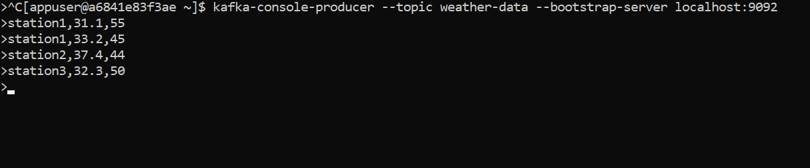
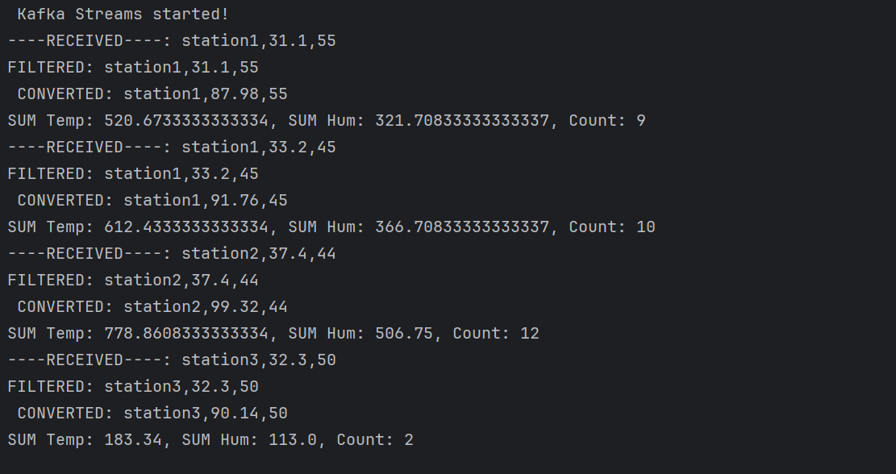

<h1>Weather Stream App 🌦️</h1>

Ce projet est un exercice d’introduction à Kafka Streams qui simule le traitement en temps réel de données météorologiques. L’application consomme des événements (température, ville, etc.) depuis un topic Kafka, applique des transformations (comme le filtrage des températures élevées ou l’agrégation par ville), puis publie les résultats vers un autre topic.
L’objectif principal de ce TP est de se familiariser avec :
  - La création d’une application Kafka Streams avec Java.
  - Le traitement de flux en continu.
  - Les opérations comme map, filter, groupByKey, et reduce.
  - L'utilisation de topics d'entrée et de sortie pour visualiser les résultats.
<h3>Enonce de l'exercice</h3>
Exercice 1 : Analyse de Données Météorologiques

Une entreprise collecte des données météorologiques en temps réel via Kafka. Chaque
station météorologique envoie des messages dans le topic Kafka nommé 'weather-data'. Les
messages ont le format suivant :
station,temperature,humidity
- station : L'identifiant de la station (par exemple, Station1, Station2, etc.).
- temperature : La température mesurée (en °C, par exemple, 25.3).
- humidity : Le pourcentage d'humidité (par exemple, 60).

Vous devez créer une application Kafka Streams pour effectuer les transformations suivantes
:
1. Lire les données météorologiques : Lisez les messages depuis le topic Kafka 'weather-data'
   en utilisant un flux (KStream).
2. Filtrer les données de température élevée
- Ne conservez que les relevés où la température est supérieure à 30°C.
- Exemple :
- Input : Station1,25.3,60 | Station2,35.0,50
- Output : Station2,35.0,50
3. Convertir les températures en Fahrenheit
- Convertissez les températures mesurées en degrés Celsius (°C) en Fahrenheit (°F) avec la
  formule :
  Fahrenheit = (Celsius * 9/5) + 32
- Exemple :
- Input : Station2,35.0,50
- Output : Station2,95.0,50
4. Grouper les données par station
- Regroupez les relevés par station (station).
- Calculez la température moyenne et le taux d'humidité moyen pour chaque station.
- Exemple :

Big Data Processing 2024

- Input : Station2,95.0,50 | Station2,98.6,40
- Output : Station2,96.8,45
5. Écrire les résultats
   Publiez les résultats agrégés dans un nouveau topic Kafka nommé 'station-averages'.
   Contraintes.

Exemple de Résultat
Données dans le topic weather-data :

Station1,25.3,60  

Station2,35.0,50

Station2,40.0,45

Station1,32.0,70

Données publiées dans le topic station-averages :

Station2 : Température Moyenne = 37.5°F, Humidité Moyenne = 47.5%

Station1 : Température Moyenne = 31.65°F, Humidité Moyenne = 65%

<h3>Résultat Attendue</h3>

